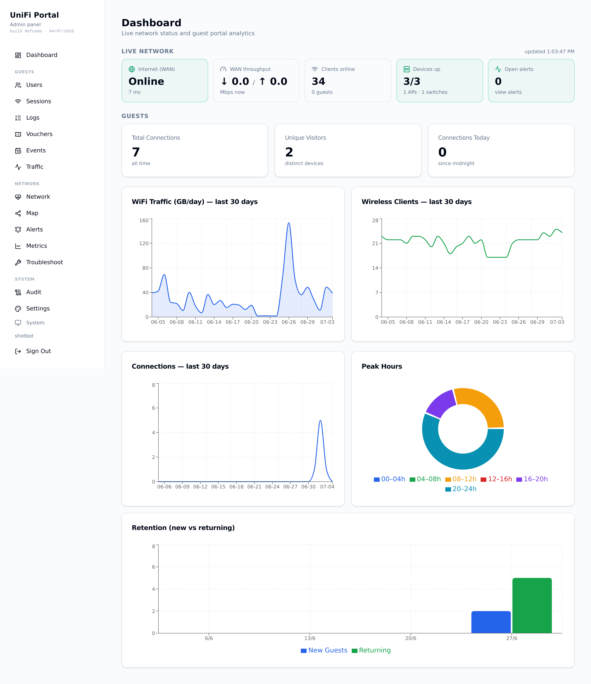
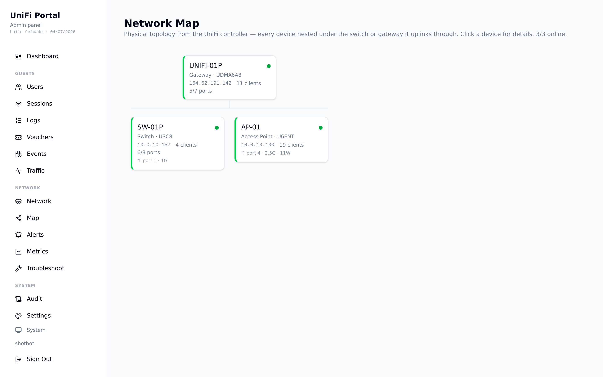
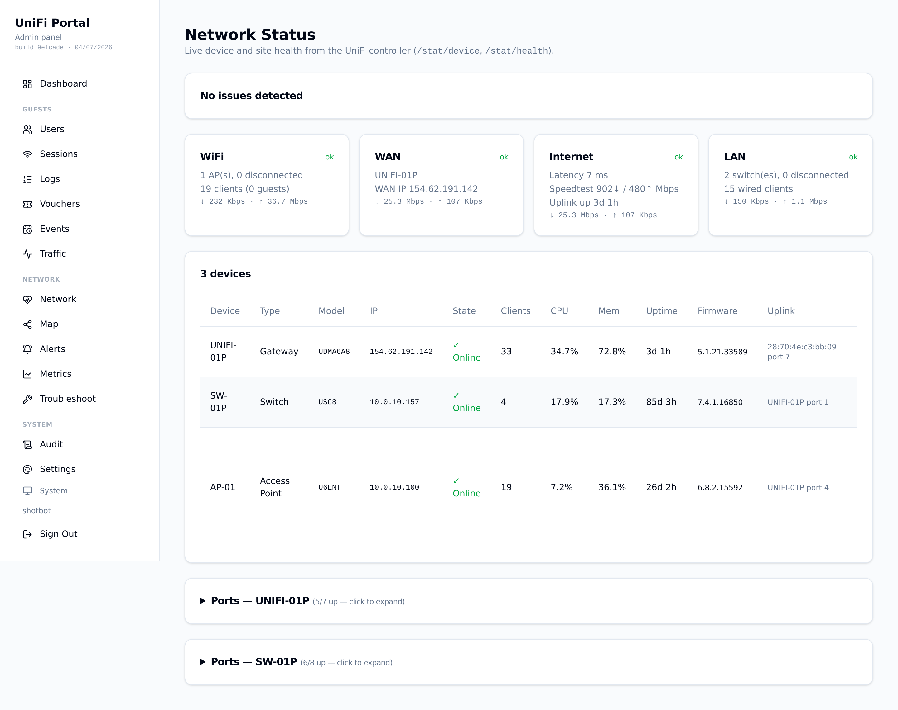
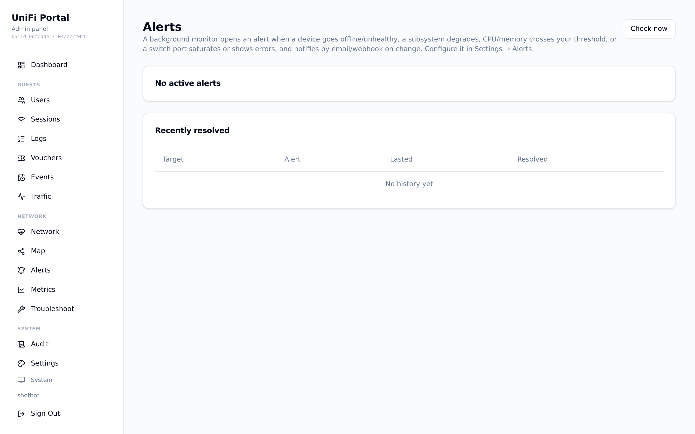
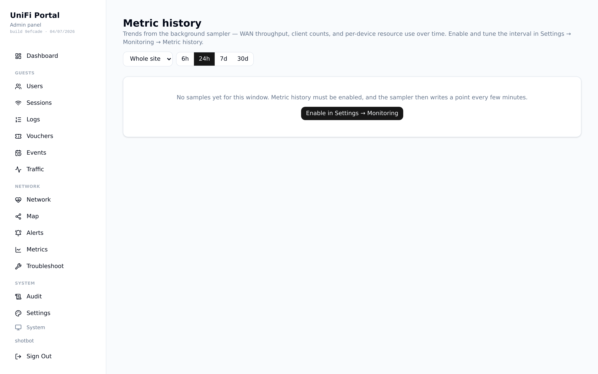
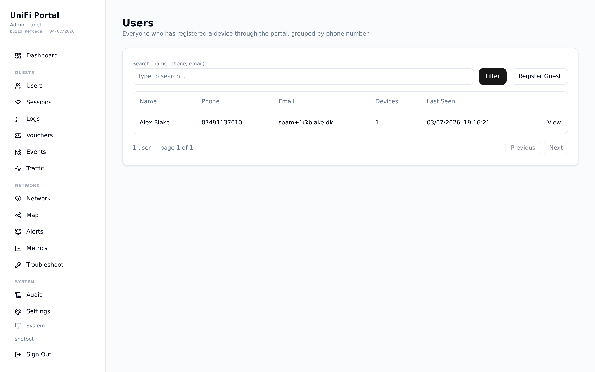
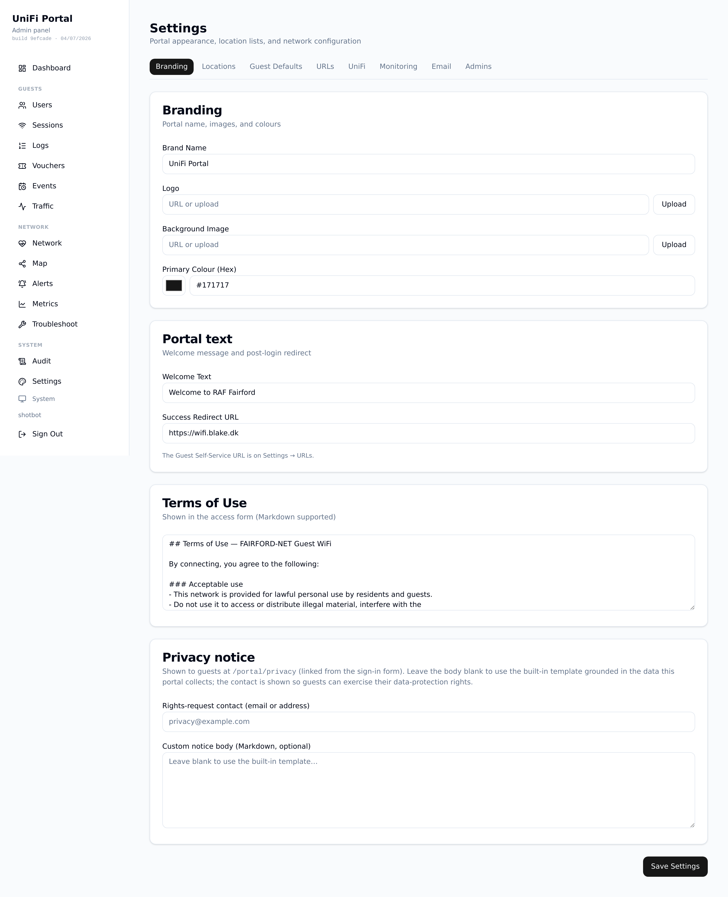
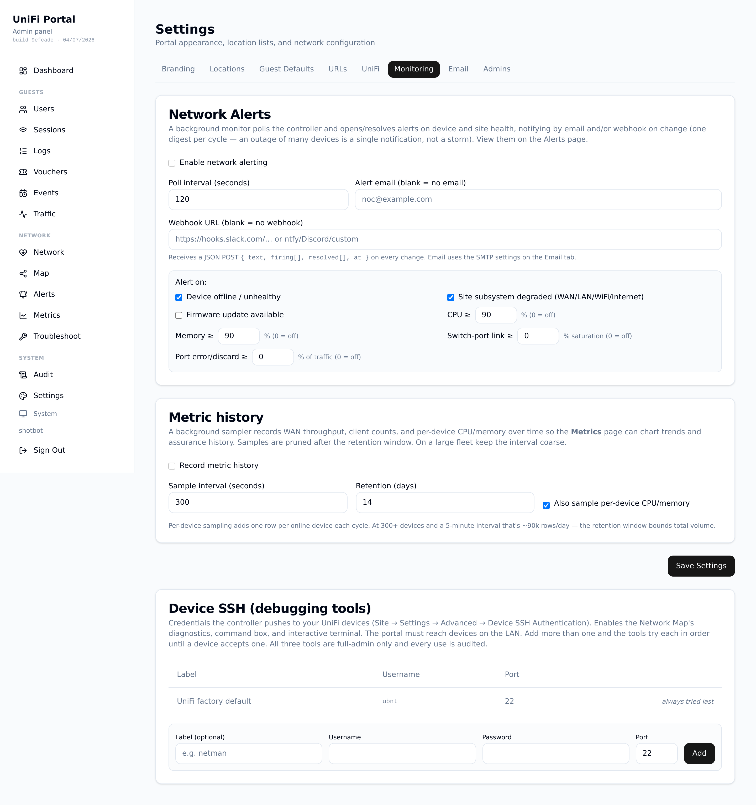
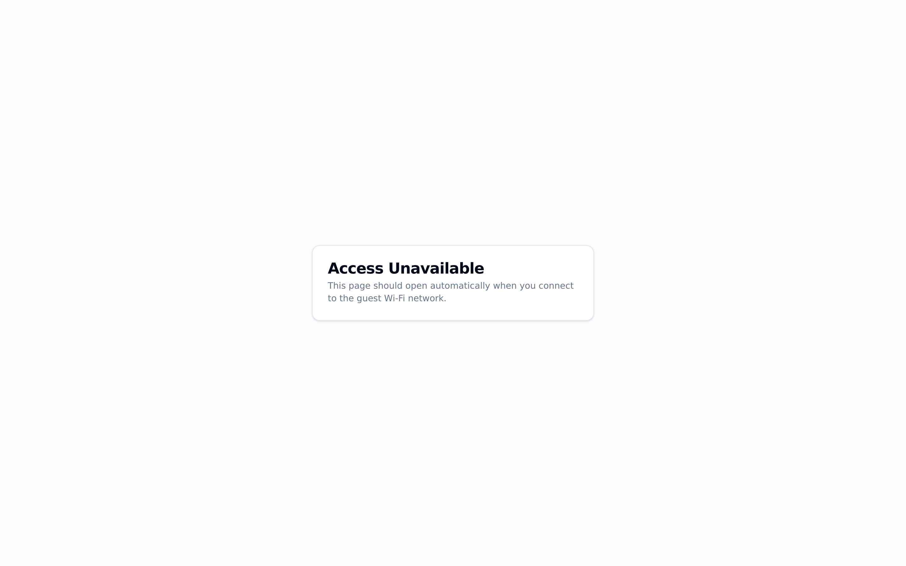
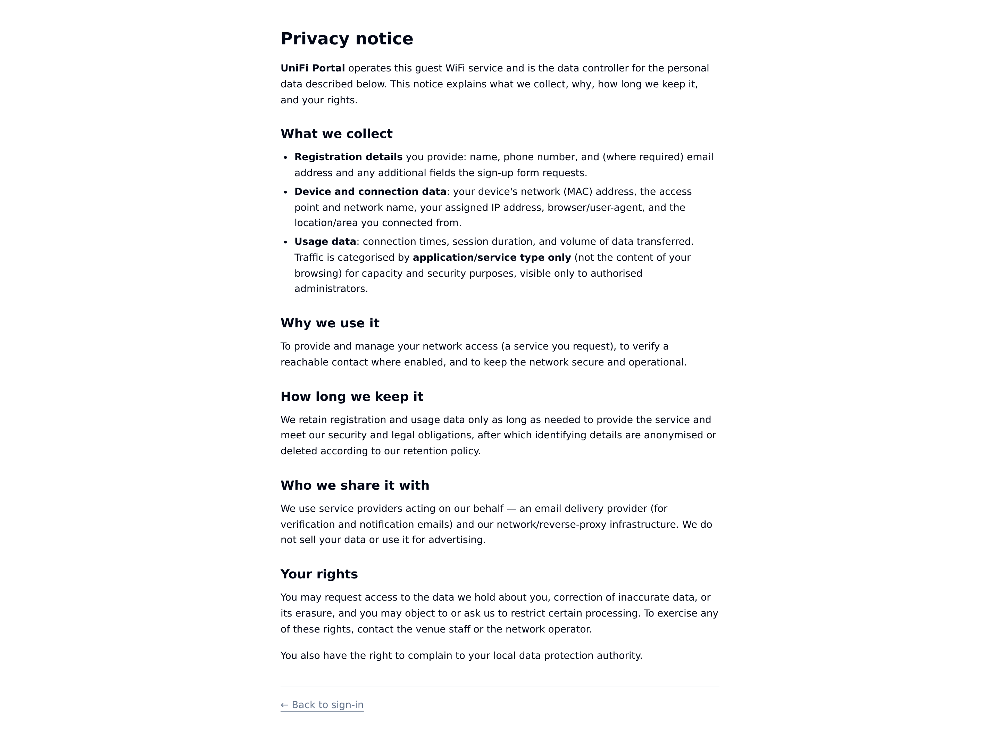

# UniFi Captive Portal

Guest captive portal (External Portal Server) integrated with the **Ubiquiti UniFi** controller, with a role-based admin panel, per-guest usage & traffic analytics, guest self-service device management, and full branding customisation.

It also carries a network-security toolkit for the controller it manages. That
includes a firewall planner which writes zone-based policies and refuses to
lock you or a critical device off the network, a PCI/Point-of-Sale segmentation
check with one-click remediation, a live firewall path test, configuration
health checks, and detection of UniFi hardware on the wire that was never
onboarded.

**Documentation map**

| File | Purpose |
|---|---|
| `README.md` | Setup, configuration, operation (this file) |
| `CHANGELOG.md` | What changed, per release |
| `docs/ROADMAP.md` | Feature comparison vs. commercial products and phased plan |
| `docs/STATUS.md` | Current handoff: deployed state, verification, known limitations |
| `docs/GO-LIVE.md` | Production go-live runbook: pre-cutover checklist, cutover, verification, day-2 ops |
| `docs/ARCHITECTURE.md` | Architecture overview + production-readiness matrix (what's in scope and why) |
| `docs/OPERATIONS.md` | Day-2 runbook: RTO/RPO, disaster recovery, rate-limit coverage, health |
| `docs/M365-EMAIL.md` | Sending portal mail through Microsoft 365 (free shared mailbox + Graph) |
| `docs/LOAD-TESTING.md` | Load-testing the guest sign-on path: harness, how to run it locally or against a live host, results |

## Screenshots

**Dashboard**: live network status (WAN, throughput, clients, devices, alerts) over guest analytics.



**Network map**: physical topology grouped by uplink, with per-device detail and remote/SSH tools.



| | |
|---|---|
| **Network health**<br> | **Alerts**<br> |
| **Metric history**<br> | **Users**<br> |
| **Settings > Branding**<br> | **Settings > Monitoring**<br> |
| **Guest portal**<br> | **Privacy notice**<br> |

## Stack

- **Next.js 16** (App Router) + TypeScript
- **Tailwind CSS 4** + shadcn/ui components
- **Prisma 7** + PostgreSQL (via `@prisma/adapter-pg`), running in its own container
- **Recharts** for analytics charts
- **react-markdown** for formatted terms of use
- **undici** for HTTPS calls to the controller (self-signed TLS support)

---

## Deployment

Deployment is Docker-only (the app runs from the CI-built image).

**Prerequisites:** Docker + Docker Compose, host ports 80/443 free (for the
bundled Traefik, or port 80 for a direct/behind-your-own-proxy install).

### Quick setup

One command to clone and bootstrap a fresh host, creates `.env` (generating
`POSTGRES_PASSWORD`/`ADMIN_SECRET`), pulls the images, brings up `db` +
`portal`, and waits for both to report healthy:

```bash
git clone https://github.com/Blake-DK/unifi-captive-portal-suite.git && cd unifi-captive-portal-suite && ./setup.sh
```

`setup.sh` pauses after generating `.env` so you can review it, then asks:
**install the bundled Traefik reverse proxy?** Yes (the default) enables the
`traefik` compose profile, Traefik publishes host ports 80/443 (setup
refuses if something else holds them) and serves your guest/admin hostnames
over HTTPS (Let's Encrypt via Cloudflare DNS-01). Because the portal itself
publishes no host port in this mode, setup then asks for the **admin URL**;
it (plus the Bundled proxy mode) is seeded into the portal's settings on
first boot, so the admin GUI is routable before you have ever signed in, and a
bare-IP catch-all on port 80 means `http://<host-ip>/admin/login` works either
way. Everything else stays GUI-managed (Settings → URLs → Reverse Proxy: ACME
email, Cloudflare token, extra proxied resources).

Answering **No** publishes the portal directly on host port 80 instead. If you
already run Traefik elsewhere, the same GUI page hands you a ready-made
HTTP-provider snippet so *your* Traefik follows the portal's route config
automatically. Re-running setup.sh later is safe: it reuses an existing `.env`,
keeps earlier choices, and skips finished steps.

Images come from GHCR (`ghcr.io/blake-dk` — packages on private repos
require authentication for every pull); if this is the first time the host
has pulled from `ghcr.io`, `setup.sh` detects the resulting "unauthorized"
error and prompts for a one-time `docker login ghcr.io` (GitHub username +
a personal access token with **read:packages**). Docker caches that login
for future pulls (this script, `deploy.sh`), so it's only needed once per
host.

To skip that interactive prompt entirely (e.g. for a scripted/non-interactive
install), set `GHCR_PULL_USER`/`GHCR_PULL_TOKEN` in `.env` before running
`setup.sh`. The token needs **read:packages**, plus **repo** if
`update.sh`/`nightly.sh` must refresh the git checkout with the same token —
a packages-only token is a trap: image pulls and deploys succeed, but
`update.sh` fails at its first step with a 403 on the repo. When set,
`setup.sh`/`deploy.sh` log in with it non-interactively before pulling, so
no prompt appears.

### Updating

One command to bring an already-running host current, the update
counterpart to the quick setup above:

```bash
cd unifi-captive-portal-suite && ./update.sh
```

`update.sh` refreshes the repo checkout (compose file + the scripts
themselves, stash-safe around the choices `setup.sh` wrote), adds any
`.env` keys introduced since your install (never overwriting existing
values), pulls the newest image, and restarts **only when the image or
`docker-compose.yml` actually changed**, so running it routinely (or from
cron; see [Backups & health](#backups--health)) costs no downtime when
there's nothing new. `./deploy.sh` remains the lower-level unconditional
deploy (pull latest, restart, health-check, verify DB migrations, prune) that
`update.sh` delegates to. Re-running `./setup.sh` reconciles `.env` the same
way.

### Manual setup

1. Copy and configure the environment file:

   ```bash
   cp .env.example .env
   nano .env
   ```

2. Choose how the portal is reached: set `COMPOSE_PROFILES="traefik"` in
   `.env` for the bundled reverse proxy (host ports 80/443), **or** uncomment
   the portal service's `ports: "80:80"` mapping in `docker-compose.yml` to
   publish it directly / behind your own proxy.

3. Pull the latest image (built and published automatically by CI - see [CI/CD](#cicd) below) and start:

   ```bash
   docker compose pull
   docker compose up -d
   ```

4. Check logs:

   ```bash
   docker compose logs -f portal
   ```

The `portal` service runs from a prebuilt image (`ghcr.io/blake-dk/unifi-captiveportal:latest`), not a local build - there's no `--build` step. Everything is plain bridge networking: the optional `traefik` service publishes host ports 80/443 and reaches the portal by service name; the database runs in its own `db` (Postgres) container, isolated on an internal bridge network not exposed to the LAN, with data persisted in the `portal-pgdata` volume; uploaded files persist in `portal-uploads`; the portal writes the bundled Traefik's static config (incl. the Cloudflare token) into `./traefik/`, and certificates persist in `traefik-acme`. Set `POSTGRES_PASSWORD` in `.env` - `docker-compose.yml` uses it both to initialize the `db` container and to build the portal's `DATABASE_URL`. The entrypoint automatically runs `prisma migrate deploy` against Postgres before starting the app.

---

## CI/CD

CI is five GitHub Actions workflows: **`ci.yml`** (every PR to `develop`/`main` + every push to `develop`: typecheck, unit tests, a fresh-DB migration check), **`security.yml`** (trivy + gitleaks + semgrep on the same PRs, plus a weekly image scan; Snyk runs as a native GitHub App check rather than a workflow job; branch protection on `develop`/`main` requires all of these contexts green before a merge is accepted), **`develop-build.yml`** (every push to `develop`: a PATCH-only `dev-v*` tag and the `:develop` image), **`nightly-build.yml`** (every push to the ungated `nightly` branch: the `:nightly` image, no tests), and **`release-and-publish.yml`**. Every push to `main` (normally a develop→main promotion PR) runs the latter: it installs deps, runs a production-dependency `npm audit` (fails on a **critical** advisory), runs semantic-release (versioning, see [Versioning & releases](#versioning--releases) below), then **builds and pushes the Docker image from the resulting `HEAD`**, tagging it `:latest` and `:<commit-sha>`. Because the build runs *after* semantic-release bumps `package.json`, the version baked into the image always matches the release (no "deploy shows the previous version" lag). One build per push (serialised by a `concurrency` group) means there is no second concurrent build to collide with. It needs the workflow's `GITHUB_TOKEN` (`contents: write` to push the release commit/tag + create the release, `packages: write` to push the image to `ghcr.io`) — no separate registry secret.

**Nightly line (fast iteration):** the `nightly` branch trades every gate for build turnaround. A push there triggers only **`nightly-build.yml`**: no typecheck, no tests, no security scanners, no version bump or tags, which builds and pushes the `:nightly` image (nothing else; the other workflows are branch-filtered and ignore it). A host opts in with `./nightly.sh`, it switches the checkout to the `nightly` branch, pins `IMAGE_TAG="nightly"` in `.env`, and hands off to `update.sh`; run it again any time to pull the newest nightly (a no-change run redeploys nothing), or keep using plain `./update.sh` once the host is switched. `update.sh` follows the branch like the other lines, and the in-app update check has a matching **Nightly** channel that compares the running image's baked commit against the branch head (there are no nightly version tags to compare). Nightly images show a red banner and must never run anywhere you care about, promote work by merging `nightly` → a `feature/*` PR into `develop` as usual.

**Moving a host between lines:** `./switch-branch.sh` asks which release line the host should follow (main / develop / nightly), switches the checkout, pins the matching `IMAGE_TAG` in `.env`, and hands off to `update.sh` to pull and redeploy on change. Pass the branch as an argument for non-interactive use (`./switch-branch.sh develop`; `-y` skips the confirmations). Moving toward stable (nightly → develop → main) leaves the newer line's database migrations in place — additive as a rule, but take a `./backup.sh` first; the script warns before descending. `nightly.sh` stays as the one-command nightly opt-in and delegates to it.

After CI publishes a new image, redeploy with `docker compose pull && docker compose up -d`.

**Which build is running?** CI bakes the commit SHA and commit timestamp into the image. The admin sidebar shows `v<version> · <short-sha> · <date>` under the panel title, and `GET /api/health` returns `{ ok, version, commit, builtAt }` - compare `commit` against the tip of `main` on GitHub to confirm the container runs the latest build.

**Is it the latest release?** Enable the **update check**: either set `UPDATE_CHECK_TOKEN` in `.env` (zero-UI: its presence enables the check), or toggle it in Settings → Monitoring with a token saved there (stored AES-encrypted; takes precedence). Either way it must be a **read-only-repository** GitHub token (only needed while the repository is private), and it deliberately lives on the host, never baked into the image, where it would hand repo-read access to anyone able to pull the image. Then `GET /api/version` answers `{ running, latest, upToDate }` from anywhere the portal is reachable, including through the public proxy hostnames:

```bash
curl -s https://portal-adm.example.com/api/version
# {"running":{"version":"1.26.0",...},"latest":{"version":"1.26.0",...},"upToDate":true,...}
```

Results are cached in-process for an hour (external monitors can poll freely without hammering GitHub), the admin sidebar shows an amber **Update available** badge when behind, and Settings → Monitoring has a **Check now** button.

### Testing

Two layers:

- **Unit tests** — `npm test` runs `src/lib/*.test.ts` on Node's built-in
  runner: pure logic (firewall planning, dup-IP gating, sorting, device
  classification, health adjustment). They run in every PR gate and again
  before each release.
- **End-to-end smoke suite** — Playwright drives the **real container** (the
  exact image that would ship) against a throwaway Postgres and a mock UniFi
  controller (`test/mock-unifi/`, a dependency-free Node server that records
  every request it gets). Four ordered specs cover the flows that matter:
  first-boot bootstrap + admin login, the UniFi settings round-trip with a
  green Test Connection, guest registration from the captive URL to the
  success page (asserting the controller actually received
  `authorize-guest`), and guest self-service login showing the registered
  device. `release-and-publish.yml` runs the suite after the usual gates and
  **before semantic-release**, so a broken flow means no version, no
  changelog entry and no image.

  Run it anywhere with docker (no Node needed on the host):

  ```bash
  E2E_IMAGE=ghcr.io/blake-dk/unifi-captiveportal:nightly bash test/e2e/run.sh
  ```

  `run.sh` composes up `docker-compose.test.yml`, builds and runs the
  Playwright container on the same network, and always tears everything
  down; on failure it dumps service logs and copies traces/reports into
  `e2e-artifacts/`.

---

## Versioning & releases

The project follows [Semantic Versioning](https://semver.org/) - `MAJOR.MINOR.PATCH` - and versioning is **fully automated** via [semantic-release](https://semantic-release.gitbook.io/), triggered on every push to `main` (`.github/workflows/release-and-publish.yml`, config in `.releaserc.json`). There is no manual release step anymore.

**Commit message convention (this is what drives versioning now):** write commits using [Conventional Commits](https://www.conventionalcommits.org/) - `<type>: <description>`, e.g. `feat: add voucher redemption`, `fix: correct guest quota rollover`. On each push to `main`, semantic-release analyzes every commit since the last release:

- `feat:` -> **MINOR** bump.
- `fix:` / `perf:` -> **PATCH** bump.
- A `BREAKING CHANGE:` footer in any commit -> **MAJOR** bump, regardless of type.
- Any other type (`docs:`, `chore:`, `ops:`, `refactor:`, etc.) does not trigger a release by itself - it's still included in the notes of whatever release it ends up shipping alongside, but won't cause a release on its own.

When at least one releasable commit lands, semantic-release automatically: bumps `version` in `package.json`, prepends a generated entry to `CHANGELOG.md`, creates the `vX.Y.Z` git tag, pushes a `chore(release): X.Y.Z [skip ci]` commit back to `main`, and creates a GitHub release with the generated notes (via `@semantic-release/github`). The **same** workflow job then builds and pushes the image from the resulting `HEAD`, so the built image is always the just-released commit (with the bumped `package.json`), no separate build that could race it or miss the release commit.

**`CHANGELOG.md` note:** entries above whatever date this automation shipped are hand-written prose (kept as a historical archive); entries from that point on are generated from commit messages - shorter and less narrative by design, since they're derived automatically rather than authored per PR.

The version is still the single source of truth in **`package.json`**; the app reads it at build time and reports it at `GET /api/health` (`version`) and in the admin sidebar.

---

## Monitoring resilience

The background alert monitor (Settings → Monitoring) normally reads
everything from the UniFi controller, so a controller outage used to be
invisible: every device-derived rule froze and nothing fired. Two settings
close that gap:

- **Controller watchdog** — after N consecutive unreachable poll cycles
  (default 3), a `controller_down` alert opens over email/webhook, which
  don't depend on the controller. It resolves itself on the first successful
  poll.
- **SNMP fallback** (optional, off by default) — while the controller is
  down, the portal polls the last-known adopted device list directly over
  **SNMPv3 authPriv** (no v1/v2c support) for basic reachability, so device
  visibility survives the outage at reduced fidelity. Requires SNMPv3
  enabled on the controller (Settings → System → SNMP) and credentials saved
  in Settings → Monitoring; use "Test SNMP now" there to verify before
  relying on it. See [docs/OPERATIONS.md](docs/OPERATIONS.md#monitoring-resilience)
  for the degraded-mode runbook.

## Backups & health

- **Database backups**: `backup.sh` dumps Postgres (gzip) **into the db container's `/backups`**, keeps 14 days, and warns if the disk is ≥ 85% full. `/backups` is a Compose mount, set `BACKUP_PATH` in `.env` to a **second location** (another disk / NAS mount); it defaults to `./backups`. Add one cron line on the host (cron emails any output; `/opt/unifi-captiveportal` here and below stands for wherever you cloned the repo - it can live anywhere):

  ```cron
  MAILTO=you@example.com
  0 3 * * *  /opt/unifi-captiveportal/backup.sh
  ```

  Each dump is written to a `.tmp` and renamed only on success, so a failed
  `pg_dump` never leaves a truncated file that rotation keeps.

- **Restore**: `./restore.sh` restores the newest dump (or a named one:
  `./restore.sh backups/portal-YYYY-MM-DD-HHMM.sql.gz`). It is **destructive**
  (overwrites the current DB) and prompts for confirmation. Stop the app first
  so nothing writes mid-restore:

  ```bash
  docker compose stop portal && ./restore.sh && docker compose start portal
  ```

  It resets the schema and applies the dump with `ON_ERROR_STOP`, so a bad
  restore aborts loudly instead of leaving a half-applied DB.
- **Container health**: the `portal` service has a Docker healthcheck hitting `/api/health`, so `docker ps` shows `healthy`/`unhealthy`. (Plain Compose does not auto-restart an *unhealthy* container, pair with your host monitoring, or an autoheal sidecar, if you want automatic restarts on hang.)

- **Updates**: `./update.sh` brings the host current in one step: fast-forwards the repo checkout (stashing the host-local compose network values around the pull and restoring them after), appends any `.env` keys the pulled `.env.example` has that yours doesn't (secrets get generated, existing values are never touched, each addition is reported), pulls the newest image, and hands off to `deploy.sh` only when the image or `docker-compose.yml` actually changed, a no-op run touches nothing. After a deploy's health check, `deploy.sh` also runs `prisma migrate status` in the container and warns if the DB schema isn't fully migrated. If `update.sh` itself changed upstream, it re-executes the new version. For unattended updates set `GHCR_PULL_TOKEN` in `.env` as above, the registry login never prompts, and the checkout refresh authenticates with the same variable when anonymous GitHub access is refused (git is run with `GIT_TERMINAL_PROMPT=0`, so a missing credential fails fast with a hint instead of hanging cron on a username prompt). Then add a cron line like the backup one:

  ```cron
  MAILTO=you@example.com
  30 4 * * *  /opt/unifi-captiveportal/update.sh
  @reboot     /opt/unifi-captiveportal/update.sh
  ```

  The `@reboot` line makes a host restart come back up **on the latest
  release** instead of whatever image it went down with, `update.sh` waits
  for the Docker daemon (up to 5 minutes) before doing anything, so firing
  early in boot is safe. A restart of just the container (`docker compose
  restart`) doesn't re-check; the nightly line bounds that staleness to a
  day.

  (`MAILTO` must be a crontab **variable line**, not part of the command, for
  cron to mail the job's output.) The `git pull` inside also needs credentials
  non-interactively when the GitHub repository is private: on most hosts the
  clone-time login is cached by a git credential helper and it just works;
  otherwise set `GHCR_PULL_USER`/`GHCR_PULL_TOKEN` in `.env` to a GitHub
  token with repo read access (update.sh falls back to it).

  If the pull ever reports that your local compose edits conflict with upstream compose changes, the local values are parked in `git stash list`, re-apply the macvlan subnet/gateway/IP by hand and re-run. One quirk when CI shares the host's Docker daemon (as on the reference deploy): a build finishing mid-run can briefly retag `:latest` and make `update.sh` call `deploy.sh` unnecessarily, harmless (`compose up` sees the container already matches), and a cron slot away from CI activity avoids it entirely.

---

## Environment variables

`.env` is infra-only: what the container needs before the database or the
admin GUI exist. Everything else, the UniFi controller, guest session
defaults, portal/guest/admin URLs, the reverse proxy, device caps, is configured
**after first boot in the admin GUI** (mostly Settings → UniFi / Guest
Defaults / URLs) and stored in the database, not `.env`. There is no env
fallback for those anymore; a blank GUI field just means "not configured yet."

| Variable | Required | Description | Example |
|---|---|---|---|
| `DATABASE_URL` | Yes | Postgres connection string | `postgresql://portal:pw@db:5432/portal` |
| `POSTGRES_PASSWORD` | Yes (Docker) | Password for the `db` container's Postgres user; also used to build `DATABASE_URL` in `docker-compose.yml` | *(generate with `openssl rand -hex 24`)* |
| `ADMIN_PASSWORD` | Yes | **First-time-setup / recovery password only** - not a shared login. Works with a blank username solely while no admin-role account exists (see [Admin accounts & roles](#admin-accounts--roles)) | `StrongPassword@2026` |
| `ADMIN_SECRET` | Yes | Master secret: signs admin session cookies **and** derives the key that encrypts secrets at rest (UniFi/SMTP/Cloudflare/SSH secrets, TOTP secrets). Keep it stable and backed up, changing it invalidates sessions and makes stored secrets unreadable (re-enter them). | *(see below)* |
| `GUEST_SESSION_SECRET` | No | Signs guest session/magic-link/email-verify tokens. Blank = derived from `ADMIN_SECRET` (fine for most deployments). Only set if you want guest sessions fully isolated from the admin secret, changing it invalidates all live guest sessions/magic links/email-verify links. | *(see below)* |
| `BACKUP_PATH` | No | Second location for DB backups, mounted to `/backups` in the `db` container; default `./backups` | `/mnt/nas/portal-backups` |

**Configured in the GUI instead (Settings):** UniFi controller URL/credentials/
site/TLS/API type, guest session duration and Kbps limits, self-service device
cap, portal/guest/admin base URLs, success redirect, the reverse-proxy
integration, and **Session Security** (require-HTTPS cookie flag, Settings →
URLs). See [Configuring the UniFi controller](#configuring-the-unifi-controller)
and [Two-hostname setup](#6-two-hostname-setup-optional).

If you're upgrading a deployment that had `COOKIE_SECURE` set in `.env` from
before it moved to the GUI: the value is migrated into the database
automatically, once, the first time the new build boots. Remove it from
`.env` at your convenience afterward - it is no longer read.

**Generate `ADMIN_SECRET`:**

```bash
openssl rand -hex 32
```

> `ADMIN_SECRET` must be at least 16 characters. The app will refuse to start with a shorter value.

---

## Admin accounts & roles

Administration is **accounts-only** - there is no shared admin password. Access follows least privilege: give each person the lowest role that covers their job.

| Capability | monitor | operator | admin |
|---|:-:|:-:|:-:|
| View dashboard, users, sessions, logs | ✓ | ✓ | ✓ |
| Manage guests & devices (create, edit, revoke, delete) | - | ✓ | ✓ |
| System settings, UniFi configuration, uploads | - | - | ✓ |
| Admin account management (create, roles, password/2FA resets) | - | - | ✓ |
| Audit trail (`/admin/audit`) | - | - | ✓ |
| Per-guest traffic data (apps/sites) | separate **Traffic data** grant, off by default, independent of role (the **first account created gets it automatically**) | | |

Enforcement notes:

- Every privileged API request re-checks the account in the **database** (existence, current role, traffic grant) - demoting, deleting, or revoking an account takes effect immediately, not at session expiry.
- Sessions are HMAC-signed cookies with a 12 h TTL. Roles are also carried in the token for page rendering, but the APIs are the enforcement boundary.
- Secrets (e.g. the UniFi controller password) are never returned to the browser; a blank field on save means "keep the current value".

### First-time setup

1. Deploy the app with `ADMIN_PASSWORD` set in `.env`.
2. Sign in at `/admin/login` with a **blank username** and that password. This opens a *setup session* pinned to the account-creation page.
3. Create your personal **admin** account, sign out, and sign back in with it. The setup login stops working the moment an admin account exists.

### Recovery

If the last admin-role account is ever lost, the blank-username + `ADMIN_PASSWORD` setup login re-opens automatically (it is keyed to the count of admin-role accounts). Remove `ADMIN_PASSWORD` from `.env` to disable this path entirely.

### Two-factor authentication (TOTP)

Each account manages its own 2FA at **`/admin/account`** (click your username in the sidebar): scan the QR code with any authenticator app, confirm a code, done. Login then requires the 6-digit code after the password. Admins can reset a colleague's lost 2FA (and passwords) from **Settings -> Admins**. TOTP is standard RFC 6238 (SHA-1, 6 digits, 30 s).

---

## Configuring the UniFi controller

### 1. Create a dedicated API user

1. Open the UniFi controller panel.
2. Go to **Settings -> Admins -> Add New Admin**.
3. Check **Restrict to local access** and set the role to **Site Admin**.
4. Note the credentials - you'll enter them in **Admin -> Settings -> UniFi** next.

### 1b. Optional: Integration API key (UniFi OS 4+ / Network 9+)

On top of the local account you can add an **Integration API key** (UniFi:
**Settings -> Control Plane -> Integrations -> Create API Key**) under
**Admin -> Settings -> UniFi -> Integration API Key**, and verify it with
**Test API Key**.

The key **supplements, it cannot replace, the local account**: UniFi's
Integration API only covers a read subset (sites, clients, devices). Guest
authorization with bandwidth/quota, client notes, user-group throttling,
sessions, events and all configuration have no Integration-API equivalent and
always use the local account. What the key buys you is resilience: with one
set, the basic monitoring reads keep working (with reduced detail) even when
the cookie login is unavailable, e.g. a locked account or a changed password.

### 2. One-click hotspot configuration (recommended)

From **Admin -> Settings -> UniFi**:

1. Fill in the controller connection (URL, username, password, site), **save**, and click **Test Connection**: the test uses the saved values, so save first. (The portal's own URL lives in Settings → URLs as the **Captive Portal URL**.) The result box grades both mechanisms separately: green = everything configured works, amber = one of username/password login and API key works, red = nothing does. With an Integration API key saved, **Fetch sites** turns the free-text Site Name into a dropdown of the controller's sites (display name shown, internal short name stored).
   If the controller reports the account **locked out** (too many failed logins), the portal stops all login attempts for 30 minutes so the lock can expire, every retry would extend it. Test Connection reports the remaining wait instead of probing; monitoring reads ride the API-key fallback meanwhile. Saving changed credentials (or restarting the container) clears the backoff immediately.
2. Click **Check Configuration** - the app logs into the controller and shows a ✅/❌ checklist of the guest-portal settings (`guest_access` section) against what this portal needs, plus every SSID with its guest-policy state.
3. Tick the SSID(s) that should use the hotspot and click **Apply Hotspot Configuration** - the app pushes the external-portal settings and syncs the SSID guest policies in one step.

### 2b. Manual alternative

1. Go to **Settings -> Profiles -> Guest Hotspot** (or **Hotspot** in the sidebar depending on your version).
2. Under **Authentication Methods -> One Way Methods**, enable **External Portal Server** and click **Edit**.
3. In the **External Portal** field, enter the IP (or hostname) of the server running this app.
   > The controller will redirect clients to `http://SERVER_IP/guest/s/default/?id=<MAC>&...`
4. Click **Save**.
5. Go to **Settings -> WiFi**, edit the guest SSID, and enable the **Guest Hotspot** policy on it.

### 3. Pre-authorisation access (Walled Garden)

Under **Pre-Authorization Access**, add the server's IP and port (`SERVER_IP:80`) so that clients' browsers can load the portal before they are authenticated.

> [!IMPORTANT]
> If you use logos or backgrounds stored at **external URLs**, you must also add those domains to the Pre-Authorization list so images load before login. Using **Local Upload** in the admin panel avoids this entirely.

### 4. Full flow after configuration

```
1. Client connects to the guest SSID
2. Client tries to access any website
3. UniFi redirects to:
   http://SERVER_IP/guest/s/default/?id=<MAC>&ap=<APMAC>&ssid=<SSID>&url=<originalUrl>
4. App redirects internally to /portal
5. Client fills in the form (name, email, phone, etc.)
6. Backend validates, saves to Postgres and calls authorize-guest on UniFi
7. Client is redirected to the configured Success URL (Settings -> Branding) or the original site, with a link to add further devices (see below)
```

### 5. Canonical host redirect

Visiting the server's bare IP or hostname redirects straight to `/portal`. If **Portal Base URL** (Settings -> URLs) is set and the request's `Host` header doesn't match it, the app redirects to that canonical origin first (e.g. visiting `http://10.90.0.232/` redirects to `http://portal.example.com/portal` if that's what the Portal Base URL is set to) - useful to know when debugging unexpected redirects while testing via IP vs. DNS name.

### 6. Two-hostname setup (optional)

The captive host can be kept registration-only by giving guest self-service its own URL (Settings -> URLs -> **Guest Self-Service URL**, e.g. `https://wifi.example.com`, typically served over HTTPS by a TLS-terminating reverse proxy pointing at this same app). When set:

- `/portal/login`, `/portal/my-devices`, `/portal/my-info`, and `/portal/verify` redirect to that URL when reached on any other host (query strings, including verify tokens, are preserved).
- The success page's magic link, the registration form's "Manage your devices" link, and the verification-email links all point at it.
- Visiting the self-service host's root goes to `/portal/login` instead of the registration flow.
- Guest session cookies are host-only, so sessions live entirely on the self-service host - exactly where they're used. Keep **Require HTTPS for session cookies** (Settings -> URLs -> Session Security) off while the captive host is plain HTTP; non-Secure cookies still work over the HTTPS hosts.

Blank = single-host behavior (everything on the captive host, as before). The admin UI is unaffected either way - front it separately (e.g. `https://portal-adm.example.com`, Settings -> URLs -> **Admin URL**).

**Portal-managed Traefik:** the portal is its own reverse-proxy manager. In Settings -> URLs -> Reverse Proxy you pick the mode, **Bundled** (the compose stack's own Traefik container, enabled by setup.sh via `COMPOSE_PROFILES=traefik`), **External** (your existing Traefik anywhere on the LAN), or **None**. Routes are never written by hand: Traefik polls `GET /api/traefik/config` (token-gated, via its built-in HTTP provider) and receives routers/services built live from the URL settings and the **Proxied Resources** list, extra LAN services that get a hostname + HTTPS through the same proxy. Root domains are entered once in the **Domains** box; a new resource is then subdomain + base-domain dropdown, plus how Traefik reaches the target: scheme dropdown (`http`/`https`/`h2c` for gRPC-style cleartext HTTP/2) + host + port. `https://` targets skip upstream certificate verification (LAN services are almost always self-signed), so they work like they do behind Nginx Proxy Manager. Guest-facing hostnames automatically block `/admin/*` and `/api/admin/*` at the proxy; HTTPS hosts get Let's Encrypt certificates via Cloudflare DNS-01 (zone token + ACME email entered in the GUI, stored encrypted; the portal writes Traefik's static config into `./traefik/`). External mode instead hands you a copy-paste HTTP-provider snippet, your Traefik then follows every change on the page automatically, or a point-in-time YAML export for file-provider setups. Resource changes are audited and go live on the next config poll (seconds).

---

## Guest self-service device management

Game consoles and other devices with no browser (Xbox, PlayStation) can't complete the captive-portal form themselves. Once a guest has registered one device via `/portal`, they can:

1. Tap **Manage your devices** on the post-registration success page - a signed, short-lived (20 min) magic link that logs them straight into the self-service page in their default browser, bypassing the sandboxed captive-portal webview's separate cookie jar. (Opening in the actual default browser vs. staying in the webview is OS-controlled and best-effort - either way the link works.)
2. Or go to `/portal/login` any time and log in with the **phone number + last name** they registered with.

From `/portal/my-devices` they can add a new device by typing its MAC address (found in the console's network settings) and remove devices they no longer need. Removing a device revokes it on the UniFi controller and marks it revoked in the database (not deleted, to preserve the admin audit trail - see Admin Panel -> Logs). The number of devices a phone number can have authorized at once is capped by **Max Devices per Phone Number**, configurable at Admin Panel -> Settings -> Guest Defaults (default: 5).

Self-service login is phone + last name matching an existing registration. There's no SMS/OTP on the phone number - a deliberate low-friction tradeoff, not a strong identity guarantee.

### Email verification

Optional (Settings -> Email, off by default; needs working SMTP settings). When enabled, registration requires an email address and works like this:

1. The guest registers and gets a short **free window** online (default 60 min). A branded confirmation email is sent with a link.
2. The link opens `/portal/verify`, signs the guest in automatically, and a single click confirms the address - all their active devices are upgraded to the configured full duration on the spot.
3. If the free window lapses unverified, reconnecting shows a "you didn't confirm your email - check your inbox" screen offering a **grace window** (default 30 min) and a resend button, so they can reach their inbox. The device list shows the same nudge as a banner.

Until verified, a guest can't add extra devices and renewals only re-grant the grace window. Changing the profile email resets verification for the new address. The email's subject/heading/body/button text are editable in the GUI, and the message is rendered with the Branding logo and primary colour; a **send test email** button previews the result.

`/portal/my-devices` also shows each device's live UniFi connection status (online/offline and which access point it's on, refreshed roughly every 20 seconds), a 24 h usage sparkline with totals, and the time remaining until the authorization expires ("Never" when the duration is set to unlimited) with a one-click **Renew**. Guests can give each device an optional custom label (e.g. "Xbox - Living Room") separate from whatever hostname UniFi detects, and the add-device form includes expandable MAC-address-finding instructions for Xbox, PlayStation, Nintendo Switch, and smart TVs. From `/portal/my-info` a guest can update their first/last name and email - this applies to all of their active devices; the phone number stays fixed, since it's what self-service login is keyed on. The layout is responsive: the device table becomes stacked cards on phones.

---

## Branding and customisation

Full visual identity customisation is available through the Admin Panel:

- **Brand name** - changes the page title and portal text.
- **Logo** - local upload or external URL.
- **Background** - custom background image for the portal.
- **Primary colour** - hex value applied to buttons and highlights.
- **Terms of use** - Markdown editor with a mobile-optimised modal preview.

Go to **Admin Panel -> Settings** to configure.

---

## Accessing the system

| Interface | URL |
|---|---|
| Guest portal | `http://SERVER_IP/portal` |
| Guest self-service login | `http://SERVER_IP/portal/login` |
| Admin panel | `http://SERVER_IP/admin` |

Admin sign-in is per-account (see [Admin accounts & roles](#admin-accounts--roles)); on a fresh install run [First-time setup](#first-time-setup).

### Admin panel overview

- **Dashboard** - connection stats and site-wide WiFi traffic / guest-count charts.
- **Logs** - every registration with CSV export.
- **Sessions** - live authorized clients from the controller (guest - linked to their profile - IP, SSID, access point, VLAN, network, data used), with revoke.
- **Users** - searchable guest directory; per-guest profile editing, devices (live status, usage sparklines, expiry, revoke), connection sessions, roaming history, add-device-on-behalf, and **Delete User** (kicks devices and erases all records).
- **Traffic** *(only with the Traffic data grant)* - site-wide and per-guest app/category breakdown from UniFi traffic identification.
- **Audit** *(admin role)* - append-only trail of admin actions, guest self-service changes, logins, permission denials, and traffic-data lookups, with filters and CSV export.
- **Settings** *(admin role)* - branding, portal texts, **locations** (up to 12 clickable tiles with logos, per-location building lists and data-retention policy, plus the retention defaults and audit-log window), **email** (guest email verification with free/grace windows, SMTP server, email template design, test send), UniFi connection + one-click hotspot config, **Network Review** (a read-only firewall rule builder, tick the networks allowed to reach the portal/Traefik and it generates a rule set to apply by hand in the UniFi console, plus stability recommendations derived from the controller snapshot), guest defaults (duration, speed, quota, device cap), and admin account management.

---

## Project structure

```
unifi-captive-portal/
|--- .github/workflows/
|   `--- release-and-publish.yml  # CI: audit + semantic-release + build/push image on push to main
|--- prisma/
|   |--- schema.prisma            # Database schema (GuestRegistration, AdminUser, AuditLog, SystemSettings)
|   `--- migrations/              # Migration history (applied automatically on boot)
|--- prisma.config.ts             # Prisma 7 adapter config (Postgres via @prisma/adapter-pg)
|--- public/
|   `--- uploads/                 # Images uploaded via the admin panel
|--- src/
|   |--- proxy.ts                 # Edge middleware: session gating for /admin and guest pages
|   |--- app/
|   |   |--- guest/s/[site]/      # Captures the UniFi redirect
|   |   |--- portal/              # Captive portal form
|   |   |   |--- login/           # Guest self-service login (phone + last name)
|   |   |   |--- my-devices/      # Guest device list (status, usage, expiry, renew, labels)
|   |   |   |--- my-info/         # Guest profile editing
|   |   |   `--- success/         # Post-registration success + magic link
|   |   |--- admin/
|   |   |   |--- account/         # Per-account 2FA self-service
|   |   |   |--- traffic/         # Site-wide DPI report (traffic grant)
|   |   |   |--- users/           # Guest directory + per-guest detail pages
|   |   |   `--- settings/        # branding/, portal/, unifi/, guest-defaults/, admins/
|   |   `--- api/
|   |       |--- portal/          # authorize, login, logout, devices (+renew), profile, session/magic
|   |       `--- admin/           # settings, logs, upload, guests, users, accounts, 2fa,
|   |                            #   traffic, unifi/test, unifi/hotspot
|   |--- components/
|   |   |--- portal/              # Portal UI (LoginForm, AddDeviceForm, label editor...)
|   |   `--- admin/               # Tables, charts, TrafficReport, SettingsNav, forms
|   `--- lib/
|       |--- unifi.ts             # UniFi HTTP client (classic + v2 traffic API)
|       |--- config.ts            # Runtime config (DB settings with env fallback)
|       |--- crypto.ts            # Shared HMAC sign/verify primitives
|       |--- auth.ts              # Admin session tokens, roles, setup sentinel
|       |--- adminGuard.ts        # requireAdmin(): DB-checked role/grant gate for admin APIs
|       |--- adminSession.ts      # Session helpers for server components
|       |--- passwords.ts         # scrypt password hashing for admin accounts
|       |--- totp.ts              # RFC 6238 TOTP (2FA) on Web Crypto
|       |--- guestAuth.ts         # Guest session + magic-link tokens via HMAC
|       |--- guestDevices.ts      # Device-listing/active-registration logic
|       |--- deviceOps.ts         # Shared add/revoke/renew device operations
|       |--- liveStatus.ts        # Cached live client status (per-MAC, ~20 s)
|       |--- usageStats.ts        # Cached per-client hourly usage
|       |--- trafficReport.ts     # DPI usage aggregation (apps/categories)
|       |--- dpiCatalog.ts        # Generated DPI app/category id -> name catalog
|       |--- mac.ts               # MAC address parsing/canonicalization
|       `--- useAdminSettings.ts  # Shared hook for the settings category pages
|--- Dockerfile
|--- docker-compose.yml
`--- entrypoint.sh
```

---

## UniFi API endpoints used

| Endpoint | Method | Description |
|---|---|---|
| `/api/login` | POST | Authenticate (Classic controller) |
| `/api/auth/login` | POST | Authenticate (Network Application / UniFi OS; requests are proxied under `/proxy/network`) |
| `/api/s/{site}/cmd/stamgr` | POST | `authorize-guest` / `unauthorize-guest` |
| `/api/s/{site}/stat/guest` | GET | Active guest sessions with statistics |
| `/api/s/{site}/stat/sta` | GET | All connected clients (live device status) |
| `/api/s/{site}/stat/device` | GET | Site devices (access-point name lookup) |
| `/api/s/{site}/stat/report/hourly.user` | POST | Per-client hourly usage (sparklines) |
| `/api/s/{site}/stat/report/daily.site` | POST | Site-wide daily traffic/clients (dashboard charts) |
| `/api/s/{site}/stat/session` | POST | Per-client connection session history |
| `/api/s/{site}/get/setting` | GET | Read controller settings (hotspot config check) |
| `/api/s/{site}/set/setting/guest_access` | POST | Apply guest-portal settings (one-click hotspot) |
| `/api/s/{site}/rest/wlanconf` | GET/PUT | List SSIDs / toggle guest policy |
| `/v2/api/site/{site}/traffic[/{mac}]` | GET | DPI app/category usage (UniFi OS gateways; app names resolved via the bundled catalog in `src/lib/dpiCatalog.ts`) |
| `/integration/v1/sites[/{id}/clients\|devices]` | GET | Optional Integration-API fallback for monitoring reads (`X-API-KEY`; UniFi OS 4+ / Network 9+) |

---

## Database

Postgres runs in its own `db` container. Schema migrations run automatically via `entrypoint.sh`'s `npx prisma migrate deploy` against `DATABASE_URL` on every container start.

**Browse data with Prisma Studio:**

```bash
npx prisma studio
```

This needs `DATABASE_URL` set correctly in your shell - e.g. if running outside Docker, point it at `localhost:5432` (or wherever your Postgres instance is reachable) rather than the in-container `db` hostname.

---

## Troubleshooting

| Symptom | Cause | Fix |
|---|---|---|
| Logo not showing on mobile | External URL blocked pre-auth | Use **Local Upload** in Admin Panel -> Settings. |
| Portal redirects but doesn't load | Server IP blocked in UniFi | Add the server IP to **Pre-Authorization Access**. |
| Build fails | Missing `public/uploads` directory | Create it: `mkdir -p public/uploads`. |
| DB connection error on startup | `db` container not healthy yet | `docker-compose.yml`'s `depends_on: db: condition: service_healthy` should already gate this - check `docker compose logs db` if it persists. |
| `docker compose up` fails to authenticate to Postgres after reusing an old volume | `POSTGRES_PASSWORD` in `.env` doesn't match what's baked into the existing `portal-pgdata` volume (Postgres only applies `POSTGRES_PASSWORD` on first init) | Either keep `.env`'s password matching the original, or wipe the volume (`docker compose down -v` - **destroys all data**) to re-init with the new password. |

---

## Privacy and security

- **Terms of use** are displayed in a scrollable modal, ensuring users can read the full policy before accepting; **consent** is recorded alongside the guest registration.
- **Data locality** - all data is stored on your own server. Enable **Require HTTPS for session cookies** (Settings -> URLs -> Session Security) if the server is internet-facing.
- **Admin authentication** - per-person accounts (scrypt-hashed passwords, optional TOTP 2FA), least-privilege roles, and IP rate-limited logins. Session cookies are HMAC-signed and `httpOnly`; privileged API calls re-check the account in the database. See [Admin accounts & roles](#admin-accounts--roles).
- **Traffic visibility** - the Traffic pages expose which apps/categories guests use (identified by the UniFi gateway; app-level, not URLs or content). This is privacy-sensitive: it sits behind a per-account grant that is **off by default**, and you should disclose traffic categorization in the portal's terms of use before enabling it.
- **Guest deletion** - the admin **Delete User** action removes all records for a guest (profile, devices, history) and revokes network access, supporting data-removal requests.
- **Data retention** - an hourly job anonymizes expired registrations per the owning location's policy (keep forever vs anonymize N days after expiry; global default for location-less rows) and prunes audit-log rows older than the configured window. Configure under Settings -> Locations; manual "Run now" available. Device MAC addresses are kept (they key controller history) - see docs/STATUS.md for accepted limitations.
- **Secrets** - the UniFi controller password is stored server-side only and never returned to the browser.
- **GDPR / data protection** - the processing inventory (ROPA), lawful bases, retention, data-subject-rights handling, security measures, sub-processors, DPIA screening, breach procedure, and the compliance backlog are documented in [GDPR.md](./docs/GDPR.md). It is an engineering-maintained plan, not legal advice - have it reviewed by your DPO/legal and publish a guest-facing privacy notice.

## License

Licensed under the [Business Source License 1.1](LICENSE) (BSL-1.1). Non-production
use is free; production use is permitted under the Additional Use Grant in the
LICENSE file. Each released version converts to the Apache License 2.0 on its
Change Date. For commercial or hosted-service licensing, contact the Licensor.
